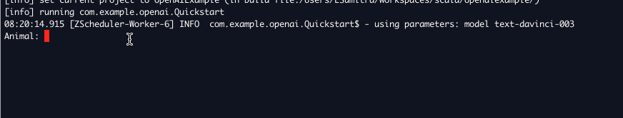

## Open AI API Scala Example
THe project illustrates how to use the Open AI API in Scala. The example calls the [Completions](https://platform.openai.com/docs/api-reference/completions) endpoint to suggest fun pet superhero names. 

The project uses the [ZIO/OpenAPI](https://github.com/zio/zio-openai) library. The project requires Java 11, Scala 3 and sbt 1.8.2+ environment to run.

### Getting started
 Use the following commands to get started with your project

 - Compile: `sbt compile`
 - Run tests: `sbt test`
 - To install in local repo: `sbt publishLocal`

### Run the example
1. Set the environment variable **OPENAI_APIKEY** to your OpenAI API key.

`export OPENAI_APIKEY=xxx`

2. Run the example with sbt

`sbt run`

See the sample run:

### Static Analysis Tools

#### Scalafmt
To ensure clean code, run scalafmt periodically. The scalafmt configuration is defined at https://scalameta.org/scalafmt/docs/configuration.html

For source files,

`sbt scalafmt`

For test files.

`sbt test:scalafmt`

#### Scalafix
To ensure clean code, run scalafix periodically. The scalafix rules are listed at https://scalacenter.github.io/scalafix/docs/rules/overview.html

For source files,

`sbt "scalafix RemoveUnused"`

For test files.

`sbt "test:scalafix RemoveUnused"`

### License
Copyright 2023, esumitra

Licensed under the MIT License.
